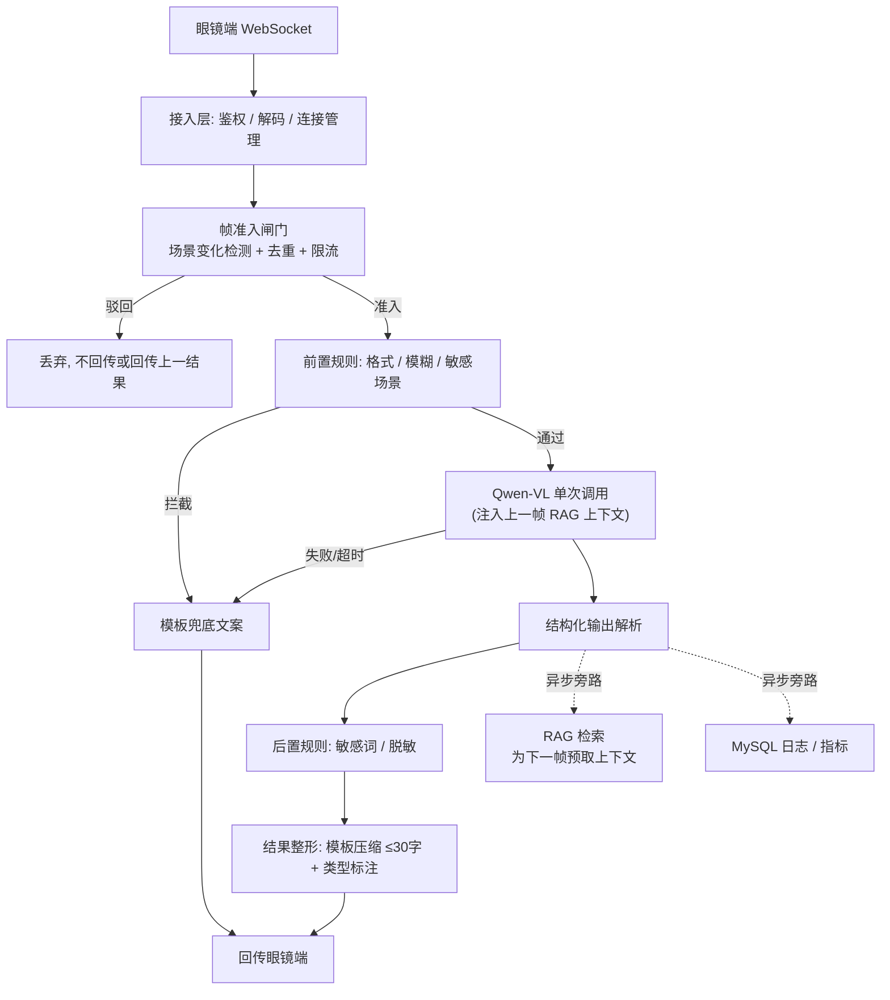

# linksee-server — 智能眼镜后端服务

## 0. 当前进度与下一步

> 这一节是本文档唯一会频繁变动的部分。完成一项就划掉并更新日期，
> 别让它变成陈旧信息——后续 session 靠它判断该从哪里接手。

**状态（2026-08-08）：骨架完成 + 阅读模式落地 + Docker 部署就绪 + API 文档重写，W1 仍差成本实测这一项。**

已完成：全链路管线跑通（gate → pre_rules → infer → post_rules → shape，含 fallback 分支）、
219 个测试通过、ruff 全过、假眼镜端到端实跑验证、延迟结构实测（模型占 88%，见 §6）。
默认配置零外部依赖（mock 后端 + 内存 KV + 不落库）。

Docker 部署就绪：`Dockerfile`（多阶段构建，可选 extras）、`docker-compose.yml`（app + Redis 7 + MySQL 8.4，带健康检查）、`.dockerignore`、`.env.docker.example`。
镜像标签使用 `${IMAGE_TAG:-dev}`，生产环境通过 `export IMAGE_TAG=$(git rev-parse --short HEAD)` 指定 commit hash。

API 文档已重写：`docs/api.md` 从 217 行扩展到 585 行，新增快速开始、消息类型速查表、限流策略对比、
错误码参考（WS close code + HTTP 状态码 + 下行 error 消息）、服务端管理接口完整字段说明。
Swagger 仍由 FastAPI 在 `/docs` 自动生成。

**阅读模式（§5.2.1）已实现**：`trigger=read` → `qwen-vl-ocr` → 分片连续下发，
协议、闸门豁免、独立限流、全文脱敏、WS/HTTP 两条通道全部打通并实跑验证。

⚠️ **但只在 mock 后端下验证过**。以下两项未做，接手前别当成已完成：
- 真实 `qwen-vl-ocr` 从未调用过（无 API key）。长文本幻觉、分栏排版顺序、
  提示词里约定的 `未发现文字` 哨兵在真机上是否稳定输出——**全部未验证**。
- 阅读模式的 token 成本未实测。§7 的第二条成本线目前是空的。

### 下一步（按优先级，做完更新本节）

**① W1 收尾：成本实测（阻塞项，最高优先级）**

这是唯一还没完成的 W1 出口条件，也是最可能推翻现有架构假设的一步。

```bash
mkdir -p tests/fixtures/frames        # 放 20-100 张真实第一视角场景帧
# .env: INFERENCE_BACKEND=dashscope + DASHSCOPE_API_KEY=sk-...
.venv/bin/python scripts/bench_cost.py measure --n 20
.venv/bin/python scripts/bench_cost.py project \
    --prompt-tokens <实测> --completion-tokens <实测> \
    --price-in <元/1k> --price-out <元/1k>
```

费率必须从 DashScope 官方价格页取当前值——脚本不内置价格，硬编码的价格过期后会给出错误结论。

跑完后**必须回填两处**：
- §7 的成本公式 → 换成 20 / 100 / 500 台三档的具体金额
- §6 表格「Qwen-VL 调用」行 → 换成真实 P50 / P95

**阅读模式要单独跑一遍**（`--trigger read`，用真实菜单/说明书照片）：它的输出 token
是普通帧的 20–30 倍，混在一起测会把普通帧的成本算高。同时确认三件事：
① 长文本有没有幻觉（编出图上没有的内容）；② 分栏排版的阅读顺序对不对；
③ 无文字画面是否稳定输出 `未发现文字` 哨兵——`parse_ocr` 靠它归一化为空。

**若 20 台已超预算**：先拉 §7 的调节杠杆（提高 `GATE_MIN_INTERVAL_S`、降 `IMAGE_MAX_EDGE`），
不要去优化后端代码——非模型环节只占 P50 的 0.8%，那条路上没有收益。

**② 确认硬件交付时间（最大外部依赖）**

§11 排期把真机联调放在 W6，§13 列为最高外部风险。现在就要向硬件团队确认交付日期。
拿不到确定日期就默认走协议模拟器（`scripts/fake_glasses.py`），并把风险上报。

**③ 协议草案发固件团队**

`docs/api.md` 已可直接发出（v0.1 草案）。重点让对方确认「固件侧必须做对的三件事」，
其中 `type:"noop"` 不清屏是最容易实现错的一条。W3 定稿。

### 按排期待办（详见 §11）

| 周 | 事项 | 备注 |
|---|---|---|
| W2 | Redis / MySQL 切真实后端 | `KV_BACKEND=redis`、`DB_BACKEND=mysql`；`inference_log` 加 RANGE 分区（`create_all` 不生成分区 DDL） |
| W3 | 协议定稿 | 结构化输出解析失败率降到 <1% |
| W4 | 人脸检测换 YOLOv8n-face | 现只有可插拔接口 + Haar 骨架，Haar 侧脸遮挡召回不足；用标注集验证 ≥95% 召回 |
| W4 | RAG 接真实 Chroma | `make install-kb` + `scripts/kb_ingest.py` + `KB_BACKEND=chroma` |
| W5 | 建 `eval/` 离线评测集 | ≥200 条。**现在没有准确率基线，改提示词无法验证不回退**。需含阅读模式样本（菜单/说明书/告示牌），专测长文本幻觉 |
| W6 | 真机联调 | 用 `docs/api.md` §5 的检查清单 |
| W7 | 用真实数据调闸门阈值 | 靠 `reject_log` 里的 `hash_distance`；注意规律性纹理（瓷砖、栅栏、斑马线）可能是 dHash 的退化输入 |
| W7 | 压测达标 | 20 台并发 P50/P95、连续 4h 无泄漏 |

## 1. 项目目标

为智能眼镜提供后端识别服务：眼镜端上传图像帧 → 后端调用多模态大模型识别并生成决策 → 回传 ≤30 字的精简结果（`text` / `voice` / `alert` 三类）。

**硬性约束（决定一切设计取舍）：**

| 约束 | 指标 |
|---|---|
| 端到端延迟 | P50 ≤ 1.5s，P95 ≤ 3.0s，超 5s 直接丢弃并返回兜底 |
| 单请求模型调用次数 | **1 次**（例外见 §5.3） |
| 结果长度 | ≤30 字 |
| 并发规模（首期） | 20 台设备在线（已确认，本阶段够用） |
| 团队 / 周期 | 3 人 / 8 周 |

延迟和成本是这个项目唯一真正的技术难点。任何增加"一跳"的设计都必须先算清它在延迟预算（§6）里的位置。

## 2. 技术栈

- **Web / 通信**：FastAPI + WebSocket（主）/ HTTP（备用、兼容老设备）
- **编排**：LangGraph 线性 `StateGraph`（**不是** Supervisor 多 Agent，见 §4）
- **多模态模型**：阿里云 DashScope `qwen-vl-plus`，强制 JSON 结构化输出
- **RAG**：Chroma（进程内只读）+ sentence-transformers（本地 CPU 向量化）
- **存储**：MySQL（持久化）+ Redis（在线状态、限流、去重、会话上下文、Checkpoint）
- **辅助**：python-dotenv、Pillow、structlog、Prometheus client

Python 3.11+。依赖锁定用 `uv` 或 `pip-tools`，`requirements.txt` 必须带 hash。

## 3. 架构：单条线性管线

业务流程是固定顺序的流水线，没有任何需要模型动态决策"下一步派给谁"的环节。因此用一条 LangGraph 线性图实现，全部节点在同一进程内、同一次 `await` 链上完成。



**关键点：RAG 检索和日志写入都在主回路之外**（图中虚线）。它们用 `asyncio.create_task` 触发，不阻塞回传。这是本方案唯一真实的并行——见 §5.2。

### 分层职责

| 层 | 职责 | 是否含模型调用 |
|---|---|---|
| 接入层 | 鉴权、WS 连接池、断连重连、编解码 | 否 |
| 帧准入闸门 | 场景变化检测、去重、限流、背压 | 否 |
| 规则层（前置/后置） | 硬约束校验、敏感拦截、脱敏 | 否 |
| 推理层 | Qwen-VL 调用 + 结构化解析 | **是（唯一）** |
| 结果整形层 | 模板压缩、类型标注、兜底 | 否 |
| RAG 旁路 | 关键词检索、上下文预取 | 否 |
| 存储/可观测 | MySQL、Redis、日志、指标 | 否 |

除推理层外全是确定性代码。不要把它们包装成"Agent"。

## 4. 设计决策与明确否决项

以下否决项来自对前一版方案的评审，**改动前必须先在此处更新理由**。

### 4.1 否决：Supervisor + 3 子 Agent 架构

流程是线性的，Supervisor 只是在每次请求上增加一次 LLM 调度调用（+1~2s）和一个故障点，换不来任何动态编排能力。而且前一版把"规则校验""结果精简"这类纯代码逻辑也包装成 Agent 节点，这些节点里根本没有模型调用——它们是函数，不是 Agent。

**采用**：单条线性 `StateGraph`，节点即 async 函数。

### 4.2 否决：Redis 消息队列做节点间通信

`task_distribute` / `result_back` 这类主题把进程内函数调用改造成了跨进程 RPC，白送延迟、序列化开销和故障点。Redis 只用于状态存储（在线状态、限流计数、去重指纹、会话上下文、Checkpoint），不做管线内消息传递。

### 4.3 否决：Agent 反思 / "执行-反思-优化"闭环

反思至少让模型调用翻倍。在 P95 ≤ 3s 的实时场景下不可接受。质量问题通过提示词工程 + 结构化输出约束 + 离线评测集解决，不靠运行时反思。

### 4.4 否决：会话粘滞路由

前一版同时要求"Redis Checkpoint 共享状态"和"粘滞路由保证同设备落同实例"，两者互相消解。

**采用**：服务无状态，全部状态在 Redis，任意 worker 可处理任意设备。WebSocket 连接天然驻留在单个 worker（连接本身有状态），但业务状态不依赖这一点——HTTP 备用接口因此也能正确工作。不需要额外的路由层。

### 4.5 否决：Chroma 多进程并发写

Chroma 本地模式并发写能力弱，多 worker 无法共享写入。

**采用**：知识库读写分离。入库/更新走**离线脚本**（`scripts/kb_ingest.py`）写入 persist 目录，生成新版本目录；worker 以**只读**方式加载到进程内存，通过运维接口 `POST /admin/kb/reload` 触发原子切换。知识库更新是低频运维操作，不是在线写路径。

### 4.6 否决：把"并行执行"写进串行依赖链

前一版声称"规则校验与 RAG 检索并行"，但 RAG 的 query 是图像识别关键词——关键词来自模型输出，检索必然在识别之后。物理上不可能并行。§5.2 给出真正可行的解法。

### 4.8 否决：LangGraph Checkpointer（本节推翻了 §8 的早期设计）

早期草案在 §8 里列了 `ckpt:{thread_id}` 这个 Redis key，实现时发现站不住：

LangGraph 的 checkpointer 在**每个节点之后**都写一次状态。6 个节点就是 6 次 Redis 往返（20-50ms），而 `FrameState` 里带着 JPEG 原始 bytes——等于每帧往 Redis 塞几百 KB。这个代价直接吃掉 §6 里所有非模型环节的预算总和（实测非模型环节合计仅 11ms）。

收益是零：单帧管线无副作用、只有 1.3 秒，失败重跑比恢复状态更便宜。真正需要跨帧保留的是会话上下文和 RAG 上下文，它们已经各自存在 `sess:ctx` / `kb_ctx` 里。

**采用**：`graph.compile()` 不挂 checkpointer，`ckpt:{thread_id}` key 不使用。若将来引入多轮追问（需要在管线中途等用户回答），再重新评估。

### 4.7 修正：敏感内容拦截不能靠敏感词列表

"人脸、涉密文档拦截准确率 ≥99%"用敏感词表 + Pillow 像素校验做不到。首期方案：

- 人脸：接入轻量本地检测器（`ultralytics` YOLOv8n-face 或 OpenCV DNN，CPU ~20ms），命中则按配置对区域打码或整帧驳回。
- 涉密文档：不做图像级判断，改为对模型 OCR 输出做关键词/正则匹配后脱敏。
- **验收指标下调为：人脸检出召回 ≥95%，OCR 脱敏规则命中率 100%**。≥99% 的整体拦截准确率首期不承诺。

## 5. 帧准入与背压（本项目最核心的机制）

### 5.1 不要处理每一帧

按 2 帧/秒连续处理的量级：

| 策略 | 单设备/天 | 10 台/天 | 100 台/天 |
|---|---|---|---|
| 2 帧/秒全量处理 | 172,800 | 1,728,000 | 17,280,000 |
| 场景变化触发（~6 次/分） | 8,640 | 86,400 | 864,000 |

差 **20 倍**。全量处理在成本和模型配额上都不可行。

**帧准入闸门规则（按顺序，任一驳回即丢弃）：**

1. **限流**：单设备模型调用 ≤ 1 次/秒（令牌桶，Redis）。
2. **去重**：计算感知哈希（`imagehash.phash`，~5ms），与该设备最近一帧比较；汉明距离 < 阈值（默认 8）判为同场景，驳回。
3. **场景变化门控**：距上次成功调用不足 `min_interval`（默认 3s）且哈希距离未超过 `force_threshold`（默认 16），驳回。
4. **用户主动触发豁免**：眼镜端带 `trigger=manual` 的帧跳过规则 2、3，只受规则 1 约束。

驳回时**不回传新结果**（眼镜端继续显示上一结果），或回传 `{"type":"noop"}`。这一点必须和眼镜端固件约定清楚。

**背压策略**：每个设备在服务端只保留**最新 1 帧**待处理（`asyncio.Queue(maxsize=1)`，满则丢弃旧帧）。实时场景下旧帧没有价值——绝不排队积压。

### 5.2 RAG 上下文预取（真正的并行）

RAG 检索依赖模型输出的关键词，无法与当前帧的识别并行。但视频帧在时间上连续、场景高度相关，因此：

> **用上一帧的关键词预取的 RAG 上下文，服务当前帧的推理。**

- 第 N 帧模型返回后，异步旁路用其 `keywords` 检索知识库，结果写入 Redis（key: `kb_ctx:{device_id}`，TTL 60s）。
- 第 N+1 帧推理前直接从 Redis 读取该上下文注入提示词——零等待。
- 会话首帧无上下文，接受首帧质量略降。

这样 RAG 检索的耗时（向量化 ~30ms + 查询 ~15ms）完全不进入延迟预算。

### 5.2.1 阅读模式（`trigger=read`）

用户主动对着菜单、说明书、告示牌触发，把画面里的文字逐字读出来，切成 ≤30 字分片连续播报。
协议见 `docs/api.md` §2.5。

它**不是**实时管线的一个变体，而是同一条线性图里按 `trigger` 分叉的一条支路——
`gate` / `pre_rules` 大部分逻辑复用，只有 `infer` 和 `shape` 真正分叉。
开第二条 `StateGraph` 会重复装配依赖、重复维护 fallback 分支，换不来隔离收益。

| 环节 | 实时帧 | 阅读模式 |
|---|---|---|
| 模型 | `qwen-vl-plus` | `qwen-vl-ocr`（专用档位，`OCR_MODEL`） |
| 延迟预算 | P50 ≤1.5s / P95 ≤3.0s | **脱离该预算**，超时 15s，指标单独统计 |
| 限流 | 1 次/秒 | 6 次/分，**独立令牌桶**（`dev:read_ratelimit:{device_id}`） |
| 去重 / 场景门控 | 生效 | 跳过（复用 manual 豁免） |
| 人脸驳回 | 生效 | 跳过（文件/菜单常含人像） |
| RAG 预取 | 生效 | 跳过（领域知识对逐字转录无价值） |
| §5.3 二次复核 | 可能触发 | 永不触发 |
| 回传 | 单条 ≤30 字 | 连续 N 条分片 |

几条关键约束：

- **独立限流桶是成本护栏，不是可选项。** 单次阅读的 completion tokens 是普通帧的 20–30 倍，
  共用实时帧的桶会让两种流量互相挤占，且连按直接烧钱。
- **分片一次性全下发，服务端不维护播报游标。** 固件本地排队播报，中断时清空本地队列即可。
  改成逐片 ack 拉取就要为每台设备存进度，等于推翻 §4.4 的无状态原则。
- **切点必须落在语义边界上**（换行 > 句末标点 > 句中标点 > 空格 > 硬切）。
  硬切会把「38 元」拆成「38」「元」，播报出来是错的。见 `app/shaping/segment.py`。
- **`ReplyMessage.seq` 是帧序号，分片位置走 `index`。** 共用一个字段会让固件把 N 片当成 N 个帧。
- 阅读模式下任何驳回都**不能返回 `noop`**。用户主动按了按钮，静默会让人以为设备坏了，
  然后反复按——正好放大限流问题。

### 5.3 单次模型调用与例外

Qwen-VL 一次调用同时完成识别 + 决策，强制返回结构化 JSON：

```json
{
  "scene": "城市人行道",
  "objects": ["red_traffic_light", "crosswalk"],
  "ocr_text": "禁止通行",
  "keywords": ["红灯", "人行横道"],
  "risk_level": "high",
  "advice": "红灯，请等待"
}
```

结果整形层**用模板 + 规则**从这个结构体生成 ≤30 字文案和 `text`/`voice`/`alert` 类型，不再调用模型。

阅读模式（§5.2.1）同样是**单次调用**，只是换了模型档位和提示词，不违反本节约束。

**唯一例外**：`risk_level == "high"` 且预取上下文为空时，允许追加一次带 RAG 上下文的复核调用。此时延迟预算放宽到 P95 ≤ 5s，且必须打点 `second_call_total` 指标监控其占比（目标 <5%）。

## 6. 延迟预算

单次成功处理（一次模型调用）的目标分解：

| 环节 | 目标 (P50) | 目标 (P95) | 实测均值 |
|---|---|---|---|
| WS 收帧 + base64 解码 | 15ms | 40ms | — |
| 闸门：感知哈希 + 限流（内存 KV） | 10ms | 25ms | **0.8ms** |
| 前置规则（Pillow 模糊检测） | 30ms | 70ms | **10.0ms** |
| 读取预取 RAG 上下文 | 3ms | 10ms | 计入 infer |
| **Qwen-VL 调用** | **1200ms** | **2500ms** | 1205ms（模拟） |
| 后置规则 + 整形 | 10ms | 25ms | **0.04ms** |
| WS 回传 | 10ms | 30ms | — |
| **合计** | **~1.28s** | **~2.7s** | **1.37s / P95 1.51s** |

模型调用占 P50 的 94%（**实测 88%**）。**结论：所有非模型环节的优化收益都在噪声级别，工程精力应投向减少调用次数（§5.1）和压缩单次调用耗时**（图像下采样、提示词精简、`max_tokens` 收紧、流式首字节）。

实测数据来自 `make bench-mock-realistic`（20 台并发 × 5 帧，`MOCK_LATENCY_MS=1200`，内存 KV）。非模型环节合计 **11ms**，只占 P50 的 0.8%——这也是 §4.8 否决 checkpointer 的直接依据。**真实验收必须用 `INFERENCE_BACKEND=dashscope` + Redis 重跑**，当前数字只验证了管线结构，不是 §12 的验收证据。

图像预处理硬要求：**上传前压到长边 ≤1024px、JPEG q=75**，眼镜端做不到则服务端做。这对模型调用耗时和成本的影响都是线性的。

## 7. 成本模型

```
月成本 ≈ 设备数 × 在线时长(h/天) × 30 × 调用次数(次/h) × 单次单价
```

单次单价 = (图像 token + 提示词 token + 输出 token) × DashScope 对应费率。
**首周必须做的事**：查 DashScope 官方价格页取当前 `qwen-vl-plus` 费率，用 100 张真实场景图跑一遍，实测平均 token 数，把这个公式填成具体数字写回本文档。

**阅读模式（§5.2.1）必须单独算一条线**，它的 completion tokens 是普通帧的 20–30 倍：

```
阅读月成本 ≈ 设备数 × 阅读次数(次/天) × 30 × (图像 token + OCR 输出 token) × qwen-vl-ocr 费率
```

按默认 `GATE_READ_RATE_PER_MIN=6` 的**上限**估算是没意义的（没人一天读 8640 次），
要用实际触发频率。W1 实测时用 `inference_log` 按 `trigger='read'` 分组聚合——
这个字段已经落库，不需要额外埋点。若阅读模式占比超预期，调节杠杆依次是：
① 降 `GATE_READ_RATE_PER_MIN`；② 降 `OCR_MAX_CHARS`（直接砍输出 token）；③ 降图像分辨率。

三档场景先算清楚：20 台 / 100 台 / 500 台设备。如果 100 台的月成本超出预算，优先级依次为：① 提高场景变化门控阈值；② 图像分辨率再降一档；③ 评估 `qwen-vl-flash` 等更低价档位并做质量对比；④ 高频简单场景用本地小模型分流。**不要靠优化后端代码解决成本问题——它不在这条路径上。**

## 8. 状态与数据模型

### LangGraph State

```python
class FrameState(TypedDict):
    # 输入
    thread_id: str          # 会话唯一标识 = f"{device_id}:{session_seq}"
    device_id: str
    frame_jpeg: bytes       # 内部传 bytes，不传 base64 字符串
    timestamp: float
    trigger: Literal["auto", "manual"]
    # 过程
    phash: str
    kb_context: list[str]   # 上一帧预取
    vl_result: dict | None  # Qwen-VL 结构化输出
    # 输出
    reply: dict | None      # {type, content}
    rejected_by: str | None # 驳回来源节点名，None 表示通过
    error: str | None
```

**注意**：State 内传 `bytes` 而非 base64 字符串，避免 33% 体积膨胀和多次编解码。仅接入层边界做 base64 转换。

### MySQL 表（5 张，不是 7 张）

| 表 | 用途 |
|---|---|
| `device` | 设备注册信息、密钥、状态 |
| `inference_log` | 每次模型调用：入参摘要、结构化输出、耗时、token、成本 |
| `reject_log` | 驳回记录：节点、原因（用于调参闸门阈值） |
| `session` | 会话轮次、上下文快照 |
| `kb_version` | 知识库版本、入库文档清单、生效时间 |

`inference_log` 是核心表，按天分区，字段设计要能直接聚合出 §6 延迟分布和 §7 成本。

### Redis key 规约

```
dev:online:{device_id}        # 在线状态, TTL 30s, 心跳续期
dev:ratelimit:{device_id}     # 实时帧令牌桶
dev:read_ratelimit:{device_id} # 阅读模式令牌桶, 独立于上一条（§5.2.1）
dev:lastframe:{device_id}     # 上一帧 phash + 时间戳
kb_ctx:{device_id}            # 预取的 RAG 上下文, TTL 60s
sess:ctx:{thread_id}          # 会话上下文, 最近 10 条, TTL 30min
```

key 只在 `app/storage/keys.py` 里拼，禁止散落到业务代码。
早期草案还列了 `ckpt:{thread_id}`，已按 §4.8 废弃，不要使用。

## 9. 目录结构

```
linksee-server/
├── app/
│   ├── main.py              # FastAPI 入口, 健康检查, /metrics
│   ├── config.py            # pydantic-settings, 读 .env
│   ├── runtime.py           # 依赖装配 + 旁路任务登记 + 单帧处理入口
│   ├── transport/           # WS / HTTP 接入, 连接管理, 鉴权, 协议(wire.py)
│   ├── gate/                # 帧准入闸门: phash, 限流, 场景门控 + 背压
│   ├── rules/               # 前置/后置规则, 人脸检测, 脱敏
│   ├── inference/           # Qwen-VL 客户端, 提示词, 结构化解析, 图像预处理
│   ├── shaping/             # 结果模板压缩, 类型标注, 兜底
│   ├── kb/                  # Chroma 只读加载, 检索, 预取旁路
│   ├── graph/               # FrameState + LangGraph 线性管线装配
│   ├── storage/             # KV(内存/Redis) + MySQL model + repo
│   └── observability/       # structlog, Prometheus 指标, 安全日志
├── docker/
│   └── mysql-init.sql       # MySQL 初始化：建库建用户
├── scripts/
│   ├── fake_glasses.py      # 假眼镜推流: W1 验证 / W6 协议模拟器
│   ├── kb_ingest.py         # 知识库离线入库
│   ├── bench_latency.py     # 延迟压测 + 逐节点耗时分解
│   └── bench_cost.py        # token / 成本实测
├── tests/
│   ├── unit/
│   ├── integration/         # 含 mock Qwen-VL 的全链路测试
│   └── fixtures/frames/     # 真实场景样例帧
├── eval/
│   ├── dataset.jsonl        # 离线评测集: 图 + 期望输出
│   └── run_eval.py          # 准确率回归
├── Dockerfile               # 多阶段构建，可选 [db,kb,face] extras
├── docker-compose.yml       # app + Redis 7 + MySQL 8.4，带健康检查
├── docker-compose.override.yml.example  # 开发覆盖：只启动后端服务
├── .dockerignore
├── .env.docker.example      # 生产部署环境变量模板
└── docs/                    # api.md / ops.md / postmortem.md（CLAUDE.md §12）
```

## 10. 分工（3 人）

按管线纵切，每人独立拥有一段，接口用 `FrameState` 字段边界界定。

**A — 管线与推理（架构负责人）**
- `graph/` + `runtime.py`（State 定义、节点装配、条件边、旁路任务、硬超时）
- `inference/`（Qwen-VL 客户端、提示词工程、结构化输出解析、超时重试降级）
- `shaping/`（模板压缩、类型标注、兜底）
- `eval/`（离线评测集 + 准确率回归）
- 统筹端到端延迟预算的落地与验证

**B — 通信与准入（对接眼镜端）**
- `transport/`（WS/HTTP、鉴权、连接池、断连重连）
- `gate/`（phash 去重、限流、场景变化门控、背压队列）
- `rules/`（前置/后置规则、人脸检测、脱敏、规则热配置）
- 与眼镜端固件的协议约定和联调（含 `noop` 语义、图像预处理约定）

**C — 知识与数据（成本与可观测）**
- `kb/` + `scripts/kb_ingest.py`（Chroma 只读加载、检索、预取旁路、版本切换）
- `storage/`（MySQL 5 表 + CRUD、Redis 封装）
- `observability/`（结构化日志、Prometheus 指标、告警）
- `scripts/bench_*.py`（延迟压测、成本实测）+ §7 成本模型填数

跨模块契约（`FrameState` 字段、Redis key、回传 JSON schema）由 A 拍板，改动走 PR review。

## 11. 排期（8 周）

原则：**第 1 周就打通端到端，把最大的技术与成本风险提前到最前面暴露。**

| 周 | 目标 | 出口条件 |
|---|---|---|
| **W1** | **端到端最小闭环** | 假眼镜脚本推图 → FastAPI → 直调 Qwen-VL → 硬编码模板回传，跑通并打出真实延迟数字。同步完成 §7 成本实测填数。 |
| W2 | 通信层 + 存储骨架 | WS 稳定长连、鉴权、断连重连；5 张表 + Redis 封装；结构化日志与核心指标上线 |
| W3 | 帧准入闸门 + 结构化输出 | phash 去重、限流、场景门控、背压队列全部生效；Qwen-VL 强制 JSON 输出稳定解析（失败率 <1%） |
| W4 | 规则层 + RAG 预取旁路 | 前置/后置规则含人脸检测；知识库离线入库 + 只读加载 + 预取上下文注入 |
| W5 | 结果整形 + 兜底 + 评测集 | ≤30 字模板体系、三类消息、全部异常路径有兜底；离线评测集 ≥200 条并跑出基线准确率 |
| **W6** | **眼镜端联调** | 真机对接，协议、图像预处理、`noop` 语义全部对齐（**硬件必须在 W6 第一天到位——这是最大外部依赖，W1 就要确认交付时间**） |
| W7 | 压测与优化 | 20 台并发下 P50/P95 达标；连续 4h 稳定性无内存泄漏；成本落在预算内 |
| W8 | 验收与交付 | 生产部署、验收测试、文档归档、复盘 |

真正的编码窗口是 W2–W5（4 周），比前一版多 1 周，因为砍掉了 Supervisor、消息队列、反思循环和一半文档。

**缓冲**：W7 预留 2 天处理联调遗留问题。若 W6 硬件延期，立刻用协议模拟器顶上，并把联调风险上报。

## 12. 验收指标

功能之外，以下指标必须有实测数据支撑，不接受"已优化"这类描述：

| 指标 | 目标 | 测量方式 |
|---|---|---|
| 端到端延迟 P50 / P95 | ≤1.5s / ≤3.0s | `bench_latency.py`，20 台并发，≥1000 次 |
| 结构化输出解析失败率 | <1% | `inference_log` 聚合 |
| 帧准入驳回率 | 90%–97% | `reject_log`（低于 90% 说明门控太松，成本会失控） |
| 二次调用占比 | <5% | `second_call_total` 指标 |
| 人脸检出召回 | ≥95% | 标注测试集 |
| OCR 脱敏规则命中 | 100% | 单元测试 + 阅读模式端到端用例 |
| 阅读模式转录准确率 | 无幻觉、分栏顺序正确 | 真实文档样本人工核对（W5 评测集覆盖） |
| 阅读模式分片 | 每片 ≤30 字、切点在语义边界 | 单元测试 + W6 真机播报验收 |
| 识别准确率 | 相对 W5 基线不回退 | `eval/run_eval.py` |
| 100 台设备月成本 | 落在预算内 | §7 公式 + 实测 token |
| 连续运行 | 4h 无泄漏、无连接堆积 | 压测 + RSS 曲线 |

**文档只交付 4 份**（前一版列了 20+ 份同义重复的文档，会实质挤占开发时间）：

1. 本文件（`CLAUDE.md`）——架构、决策、约定，随代码演进
2. `docs/api.md`——眼镜端对接协议（WS/HTTP、消息格式、`noop` 语义、图像预处理要求）
3. `docs/ops.md`——部署、配置项、指标告警、故障排查、知识库更新流程
4. `docs/postmortem.md`——W8 复盘

Swagger 由 FastAPI 自动生成，不单独写接口文档。

## 13. 风险

| 风险 | 应对 |
|---|---|
| **成本超预算**（最高风险） | W1 就实测填数；调节杠杆按 §7 优先级依次拉；预留"降级到更低价模型档位"方案并有质量对比数据 |
| **眼镜端硬件延期**（最高外部风险） | W1 确认交付时间；准备协议模拟器；协议文档 W3 定稿先发固件团队 |
| Qwen-VL 延迟抖动 / 限流 | 10s 超时 + 1 次重试（不是 3 次，重试会击穿延迟预算）；失败即走模板兜底；申请配额上调；监控 DashScope 侧 P99 |
| 结构化输出不稳定 | 提示词加 few-shot；解析失败时用正则兜底提取 `advice` 字段；失败率进指标看板 |
| 场景门控阈值调不准 | `reject_log` 记录每次驳回的哈希距离，W7 用真实数据离线调参，阈值全部走配置不硬编码 |
| 进度滞后 | W1 端到端闭环是不可妥协项；若滞后先砍 RAG（旁路可降级为空上下文），保通信 + 推理 + 规则主干 |

## 14. 开发约定

- **改架构先改文档**：本文件 §4 的否决项如需推翻，先在 PR 里更新 §4 的理由，再改代码。
- **不新增模型调用**：任何引入第二次/第三次 LLM 调用的改动，必须附延迟实测和成本影响。
- **不为确定性逻辑套 Agent 外壳**：规则、模板、格式化都是函数。
- **配置不硬编码**：所有阈值（限流、哈希距离、`min_interval`、超时、切片长度）走 `config.py` + `.env`，可热更新。
- **每个节点必须可单测**：节点是纯函数 `(state) -> state`，外部依赖走注入。
- **延迟敏感路径禁止同步 IO**：MySQL 写入、知识库检索一律 `create_task` 旁路。
- 日志用 `structlog` 输出 JSON，必带 `thread_id` / `device_id` / `node`；指标用 Prometheus，延迟一律记直方图不记均值。
- 提交信息只写变更本身，不加任何 AI co-author trailer。
